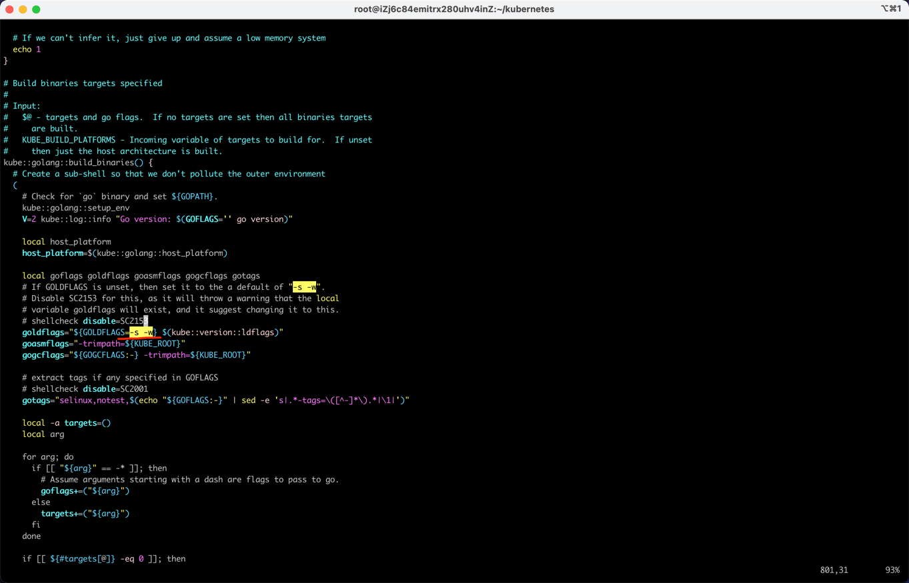
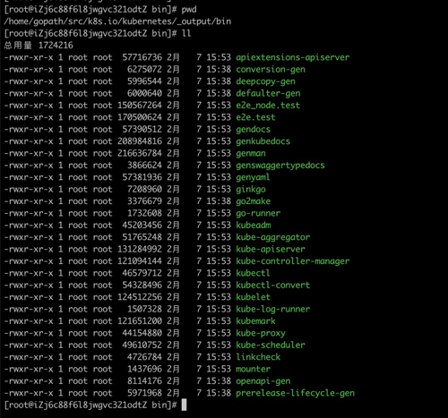
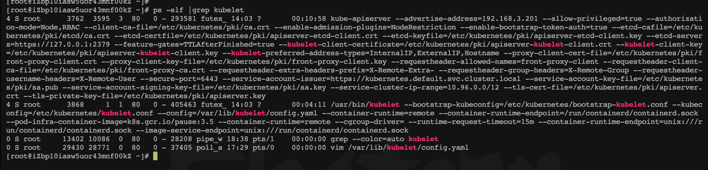
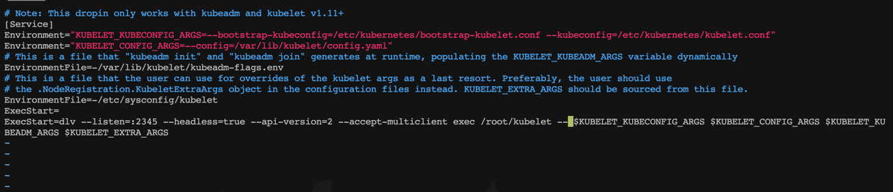
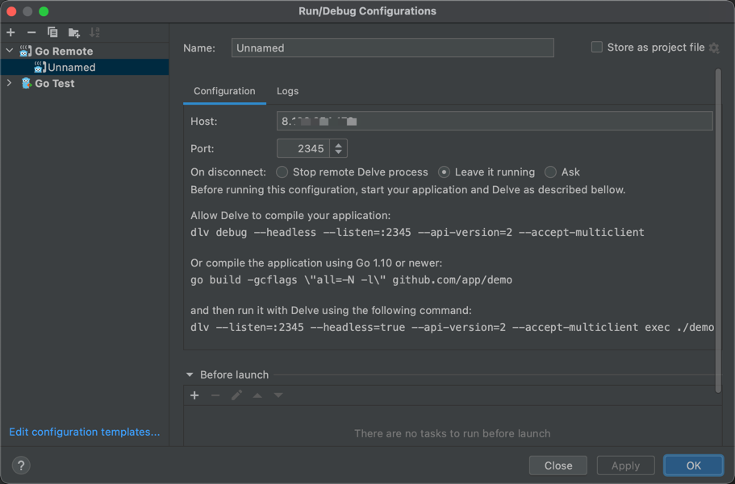

# K8s debug环境准备

##  1、编译k8s组件

1. 阿里云上申请一个香港的ecs
2. 配置yum源，因为centos8已经不再维护，默认源上已更新不了包，具体修改方式参考[CentOS 8 EOL如何切换源？ 阿里云文档](https://help.aliyun.com/document_detail/405635.html?spm=5176.21213303.J_6704733920.7.66743edaatJNuy&scm=20140722.S_help%40%40%E6%96%87%E6%A1%A3%40%40405635.S_0%2Bos0.ID_405635-RL_centos8%20yum%E6%BA%90-LOC_helpmain-OR_ser-V_2-P0_0)
3. 安装golang1.17
4. 配置go环境变量，可以参考[配置go环境变量](https://www.cnblogs.com/mingyue5826/p/11550415.html)
4. 编译k8s代码

```shell
mkdir -p $GOPATH/src/k8s.io
cd $GOPATH/src/k8s.io
git clone https://github.com/kubernetes/kubernetes
cd kubernetes
git checkout v1.22.0(编译v1.22.0版本)
# 修改编译参数，删掉-s -w，默认编译时禁用了调试信息
vim k8s.io/kubernetes/hack/lib/golang.sh 
# 编译，可通过WHAT=cmd/kubelet编译单个组件
GOOS=linux \
GOARCH=amd64 \
KUBE_GIT_TREE_STATE=clean \
KUBE_GIT_VERSION=v1.22.0 \
KUBE_BUILD_PLATFORMS=linux/amd64 \
make all GOGCFLAGS="all=-N -l"
```
删除-s -w编译参数

编译产生的二进制

5. 上传到oss，方便使用，ossutil使用参考[ossutil使用](https://help.aliyun.com/document_detail/195960.html?spm=5176.8466032.help.dexternal.7bf11450G0rERE)

## 2、使用编译生成的二进制替换k8s集群中的组件

下面替换集群中kubelet组件


```shell
# 查看集群中kubelet启动命令如下
./kubelet \
--bootstrap-kubeconfig=/etc/kubernetes/bootstrap-kubelet.conf \
--kubeconfig=/etc/kubernetes/kubelet.conf \
--config=/var/lib/kubelet/config.yaml \
--container-runtime=remote \
--container-runtime-endpoint=/run/containerd/containerd.sock \
--pod-infra-container-image=k8s.gcr.io/pause:3.5 \
--container-runtime=remote \
--cgroup-driver= \
--runtime-request-timeout=15m \
--container-runtime-endpoint=unix:///run/containerd/containerd.sock \
--image-service-endpoint=unix:///run/containerd/containerd.sock

# 修改kubelet systemd服务的配置文件，改为使用上面编译的kubelet二进制启动
systemctl stop kubelet
/etc/systemd/system/kubelet.service.d/10-kubeadm.conf ...

# 安装golang、delve
```




## 参考文章
[https://cloud.tencent.com/developer/article/1624638](https://cloud.tencent.com/developer/article/1624638)


